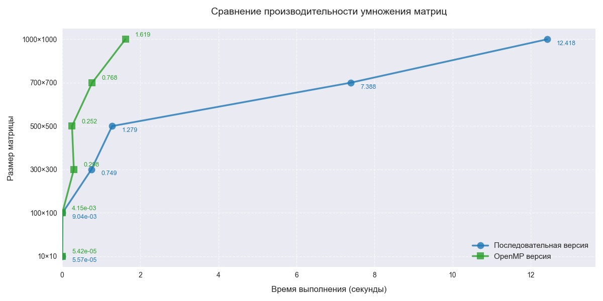

Задание:
Модифицировать программу из л/р №1 для параллельной работы по технологии OpenMP.
Результат:

| Размер      | Обычное время (сек) | OpenMP время (сек) | Ускорение |
|-------------|---------------------|--------------------|-----------|
| 10×10       | 5.57×10⁻⁵           | 5.42×10⁻⁵          | 1.03×     |
| 100×100     | 0.0399451           | 0.043515           | 0.92×     |
| 300×300     | 1.40957             | 1.29846            | 1.09×     |
| 500×500     | 5.90566             | 5.78371            | 1.02×     |
| 700×700     | 16.388              | 16.3683            | 1.00×     |
| 1000×1000   | 48.7621             | 47.6666            | 1.02×     |

Вывод: С Применением технологии OpenMP, время операций снизилось.
